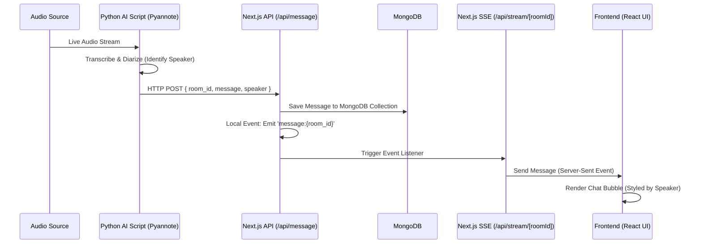

# Real-Time Transcription System Architecture

## Overview
The Real-Time Transcription System is a full-stack application designed to capture, process, and display live speaker-diarized transcriptions. It leverages a Python-based AI transcription script alongside a modern Next.js web application to deliver real-time, chat-like transcription feeds to end users.

## Tools & Technologies Used
- **Frontend & API**: Next.js 15 (App Router, React 19)
- **Styling**: Tailwind CSS, shadcn/ui components
- **Database**: MongoDB (to persistently store room transcriptions)
- **Real-Time Communication**: Server-Sent Events (SSE) via native Next.js Streams & EventEmitters
- **AI & Processing (External Script)**: Python, Pyannote AI (for speaker diarization), Audio Transcription models.

## Architecture & Data Flow



## Component Breakdown & How It Works

### 1. Audio Capture and Diarization (The Ingestion Layer)
A standalone Python script continuously listens to an audio source. It uses AI models (like Pyannote) to perform **Speaker Diarization**—the process of identifying not just *what* was said, but *who* said it (e.g., `SPEAKER_00` vs `SPEAKER_01`).

### 2. Next.js API Webhook
Once a sentence is transcribed, the Python script sends an HTTP POST request to the Next.js backend (`/api/message`) mimicking a webhook.
**Example Payload:**
```json
{
  "room_id": "858585",
  "message": "The transcribed text of the speaker's sentence.",
  "speaker": "SPEAKER_00"
}
```

### 3. Persistent Storage (MongoDB)
The Next.js API route handler validates the incoming payload and inserts a new document into the MongoDB database. The data is logically separated by `room_id`, allowing users to refresh the page or join late and retrieve the full historical context of the room.

### 4. Real-time Broadcasting (SSE)
Immediately after saving to the database, the API emits a local NodeJS server event. Clients viewing the room on the frontend establish a lightweight, unidirectional **Server-Sent Events (SSE)** connection to `/api/stream/[roomId]`. The backend local event automatically triggers this SSE stream to push the newly ingested message to all actively connected clients instantly, without requiring WebSockets.

### 5. Dynamic Frontend Rendering (Next.js UI)
The frontend React application consumes this real-time data stream dynamically:
- **Grouping Logic**: Messages are logically grouped by time constraints and continuous speaker flow to avoid visual clutter.
- **Dynamic Styling**: The UI behaves like a messaging application. It extracts the `speaker` property and algorithmically assigns alignment (left vs. right justification) and color palettes (e.g., primary vs. muted card backgrounds) to visually distinguish between speakers (`SPEAKER_00`, `SPEAKER_01`, etc).
