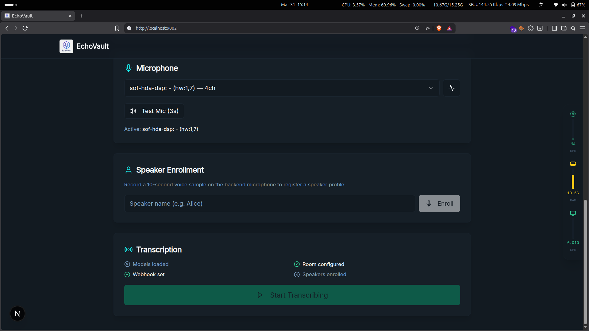

# EchoVault: Real-Time Transcription Service

EchoVault is a real-time transcription service that captures audio from a user's microphone, transcribes it using OpenAI's Whisper model, and displays the text live on a web interface. This project demonstrates a powerful integration between a local Python backend for audio processing and a modern web application for real-time data display.

## How It Works

The system is split into two main components:

1.  **The Backend (`backend_Server/final.py`)**: A Python script that runs on the user's local machine. It captures microphone audio, breaks it into chunks, transcribes each chunk using the Whisper AI model, and sends the resulting text to the frontend's API endpoint.
2.  **The Frontend (Next.js App)**: A web application that receives the transcribed text. When a message is received, it's stored in a MongoDB database and simultaneously broadcast to all clients connected to the same room using Server-Sent Events (SSE). This allows for a live, real-time feed of the transcription.

## Project Setup

For detailed instructions on how to set up and run both the backend server and the frontend web application, please refer to the [Setup Guide](./setup.md).

## Core Features

### Backend (Python Server & AI Pipeline)

- **FastAPI Control Plane**: Fully controllable via REST endpoints and a frontend web dashboard instead of a terminal menu.
- **GPU-Accelerated AI Processors**: Uses `faster-whisper` for speech-to-text, ECAPA-TDNN for speaker footprinting, and Qwen 0.5B for offline meeting summarization.
- **Real-Time WebSockets**: Streams live microphone volume levels, system stats (CPU/RAM/GPU), and AI loading states directly to the web UI.
- **Robust Audio Engine**: Dynamically captures audio at the microphone's native sample rate and uses `librosa` to perfectly resample for ML models, eliminating ALSA errors.
- **Hardware Telemetry**: Monitors VRAM and system usage live via `nvidia-smi` and `psutil`.

### Frontend (Next.js Web App)

- **Real-Time Dashboard**: A stunning control panel to configure API URLs, load AI models, enroll new speakers, and benchmark your microphone.
- **Interactive Transcriptions**: Displays transcribed messages instantly via WebSockets and Server-Sent Events (SSE).
- **AI Meeting Assistant**: After ending a session, a built-in chat UI directly queries the backend's Qwen Micro-LLM to summarize the entire meeting anonymously.
- **Stateless Memory**: Stores transcripts in MongoDB so the backend can be restarted freely without losing the LLM's meeting context.
- **Modern UI**: Built with Next.js 15, React 19, Tailwind CSS, and ShadCN components.

## System Architecture

To understand how the local AI processing pipeline interacts with the Next.js control dashboard, please view our interactive visual representation!

👉 **[Click here to open the Interactive Architecture Diagram](https://error-siddh.github.io/os_project_real_time_transcription/Interactive_Architecture.html)** *(Clone the repository and open this file in any web browser to view).*

## Tech Stack

### AI & Backend Server
- **Language**: Python
- **API Framework**: `fastapi`, `uvicorn`, `websockets`
- **Machine Learning**: `faster-whisper`, `speechbrain` (Speaker ID), `transformers` (Qwen-0.5B)
- **Audio Processing**: `sounddevice`, `soundfile`, `librosa`
- **Telemetry**: `psutil`, `nvidia-smi`

### Web Frontend
- **Framework**: Next.js 15 (App Router), React 19
- **Language**: TypeScript
- **Styling**: Tailwind CSS, ShadCN UI
- **Database**: MongoDB
- **Real-Time**: WebSockets & SSE

## Contributing

We welcome contributions to EchoVault! If you'd like to help improve the project, please follow these steps:

1.  **Fork the repository** on GitHub.
2.  **Create a new branch** for your feature or bug fix (`git checkout -b feature/your-feature-name`).
3.  **Make your changes** and commit them with a clear and descriptive message.
4.  **Push your branch** to your forked repository.
5.  **Open a Pull Request** to the main project repository.

We'll review your contribution and merge it if it aligns with the project's goals. Thank you for your interest in making EchoVault better!

## Project Authors

This project was built by:

- **Adithyan P**: [GitHub Profile](https://github.com/legitcoconut)
- **Rohit Anil Kumar**: [GitHub Profile](https://github.com/RohitAnilKumar)
- **Sidharth M**: [GitHub Profile](https://github.com/error-siddh)

The complete source code is available on GitHub:
- **Project Repository**: [https://github.com/error-siddh/os_project_real_time_transcription](https://github.com/error-siddh/os_project_real_time_transcription)
